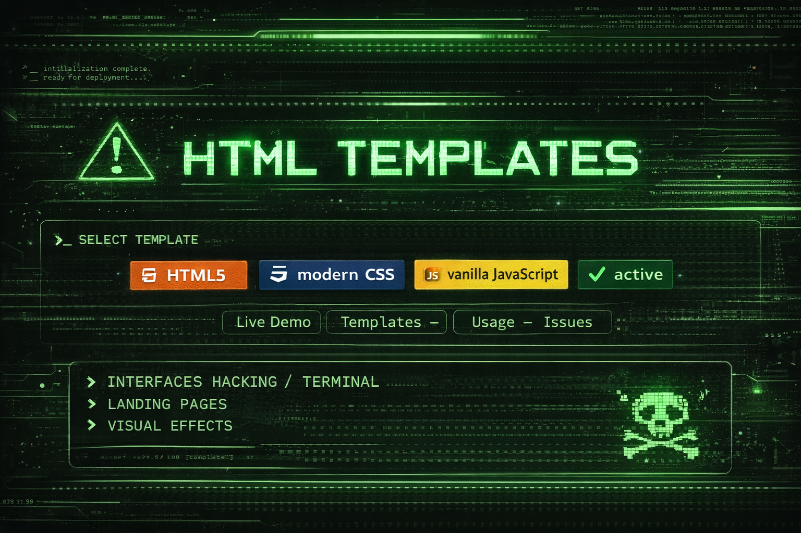

<p align="center">
  
</p>

<p align="center">
  
  
  
  
</p>

<p align="center">
  <a href="https://tuusuario.github.io">Live Demo</a> —
  <a href="#templates">Templates</a> —
  <a href="#usage">Usage</a> —
  <a href="#issues">Issues</a>
</p>

---

## 🖥️ HTML TEMPLATES COLLECTION

```bash
> initializing templates...
> loading HTML modules...
> access granted ✔

<!DOCTYPE html>
<html lang="en">
<head>
  <meta charset="UTF-8">
  <title>David | Frontend</title>
  <meta name="viewport" content="width=device-width, initial-scale=1">
  <style>
    body {
      background: black;
      color: #00ff88;
      font-family: monospace;
      padding: 40px;
    }
    h1 {
      font-size: 2.5rem;
    }
    .card {
      border: 1px solid #00ff88;
      padding: 20px;
      max-width: 600px;
    }
  </style>
</head>
<body>

  <h1>👋 Hi, I'm David</h1>

  <div class="card">
    <p><strong>Role:</strong> Frontend Developer</p>
    <p><strong>Status:</strong> Active</p>
    <p><strong>Focus:</strong> HTML Templates & UI</p>
  </div>

  <p style="margin-top:20px;">
    🌐 GitHub: <a href="https://github.com/TUUSUARIO" style="color:#00ff88">View Profile</a>
  </p>

</body>
</html>
